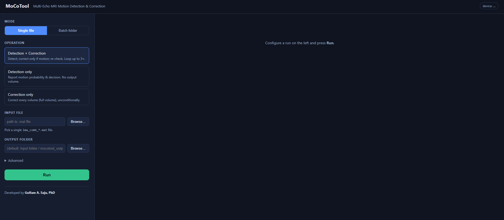

# MoCoTool — Multi-Echo MRI Motion Detection & Correction

A desktop tool that runs the Echo-Aware SubjectGate detector and the ME-PARNet
corrector on multi-echo GRE `.mat` volumes, in single-file or batch mode.

## Interface



*The browser UI. Left sidebar: mode (single file / batch folder), the three
operations (Detection + Correction, Detection only, Correction only), input and
output pickers, and an Advanced panel (decision threshold, max iterations, gate
override). The badge in the top-right shows the compute device (CPU/GPU).*

### Demo video

**[▶ Watch a short demo](images/MoCoTool.mp4)** — a complete Detection + Correction
run: detection flags the volume, correction runs with live progress, re-detection
confirms the result, and the slice/echo viewer compares the original, corrected,
and difference images. *(MP4, ~64 MB; GitHub renders it with an inline player,
locally it opens in your video player.)*

## Status

- [x] **Step 1 — Core engine** (`engine/`): load → dimension-fix → detect / correct /
      gated loop → denormalize → save → result dict.
- [x] **Step 2 — CLI** (`cli.py`): headless single/batch driver + batch Excel.
- [x] **Step 3 — Local web UI** (`ui/`, FastAPI + HTML): modes, options, pickers,
      progress/cancel, device badge.
- [x] **Step 4 — Single-mode visualization**: slice/echo sliders, original/corrected/diff.
- [x] **Step 5 — Portable `.exe`** (`MoCoTool.spec`, `build_exe.py`): see `BUILD.md`.

Run in dev: `python run_app.py`  •  Build the exe: `python build_exe.py`  •  CLI: `python cli.py ...`

## Layout

```
MoCoTool/
  weights/
    detection/  { config.json, weights.h5 }   <- drop trained detector weights here
    correction/ { config.json, weights.h5 }   <- drop trained corrector weights here
  engine/
    io_utils.py     MAT load/save (v7 + v7.3), key auto-detect, native-scale save
    dimensions.py   odd-size fix: head-centred crop (never distorts); refuses to resample
    preprocess.py   norm/denorm, channel packing, proportional slice range + adaptive top-k
    detection.py    SubjectGate runner (adaptive k/N, decision + per-slice probs)
    correction.py   ME-PARNet runner (FULL volume, denormalized output)
    pipeline.py     orchestration engine + gated detect-correct-re-evaluate loop
    reporting.py    batch Excel writer
  cli.py            command-line interface
  requirements.txt
```

## Key behaviours (as specified)

- **Full-volume correction.** The corrector ignores the training slice range and
  processes every slice.
- **Proportional detection.** The detection slice range scales with slice count,
  and top-k scales with it (**k/N held constant**: 14 at 46 slices, 28 at 92) so the
  calibrated decision threshold stays valid.
- **Gated loop.** `detect_correct` mode detects, corrects only if MOTION, re-detects,
  repeats up to `--max_iters` (default 3). The gate is overridable
  (`--force_correct` / `--skip_correct`).
- **Native-scale output.** Correction output is denormalized before saving, so the
  amplitude matches the input (prevents downstream R2* scale bugs).
- **Odd dimensions.** Volumes wider than 192 (larger phase FOV) are head-centred
  cropped; a genuine higher-resolution volume is refused rather than silently
  distorted.

## Install & run

```
pip install -r requirements.txt

# single, gated loop
python cli.py single --input "C:/data/ima_comb_110.mat" --mode detect_correct --output_dir out

# batch detection only
python cli.py batch --input_dir "C:/data/motion" --mode detect --output_dir out

# batch correction, forced
python cli.py batch --input_dir "C:/data/motion" --mode correct --output_dir out --force_correct
```

Modes: `detect` | `correct` | `detect_correct`. Batch writes `out/batch_summary.xlsx`
listing every subject's decision, whether it was corrected, iterations, dim-fix,
timing, and errors.

## Before first run

Drop the trained weights:
- `weights/detection/weights.h5`   (Echo-Aware SubjectGate)
- `weights/correction/weights.h5`  (ME-PARNet / attention_phys)

The `config.json` beside each already matches the training conventions
(detector: `echo1mean`, `complex20`, threshold 0.15; corrector: `midcube`,
`attention_phys`, full volume).
